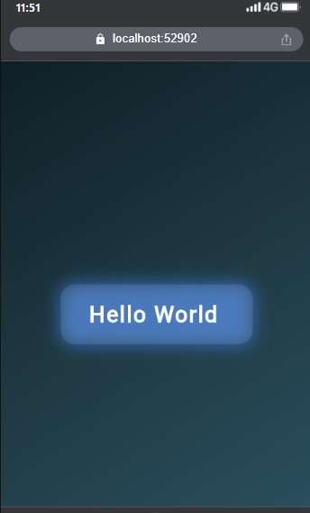

# Hello World Flutter App 

A modern, animated **Hello World** Flutter application demonstrating Flutter's UI capabilities.

- Gradient background 
- Animated scaling text 
- Modern typography 
- Works on **Chrome (Web)**, **Android Emulator**, or **Physical Devices** 

---

## Features

- Animated "Hello World" text with smooth scaling
- Professional gradient background
- Rounded container with glowing effect
  
---

## Prerequisites

Before you begin, ensure you have the following installed:

- **Flutter SDK** - [Installation guide](https://flutter.dev/docs/get-started/install)
- **VS Code** or **Android Studio** with Flutter & Dart plugins
- **Chrome browser** for Flutter Web (or Android/iOS device for mobile)

---

## Installation

1. **Clone the repository:**
```bash
   https://github.com/Aline-CROIRE/dart-school-lab2.git
```

2. **Navigate to the project folder:**
```bash
   cd hello_world
```

3. **Get dependencies:**
```bash
   flutter pub get
```

4. **Run the app:**

   ### On Chrome (Web):
```bash
   flutter run -d chrome
```

   ### On physical device (Android):
   - Enable **Developer Options** and **USB Debugging**
   - Connect phone via USB (File Transfer / MTP mode)
   - Run:
```bash
     flutter run
```

   ### On Web Server (for phone over Wi-Fi):
```bash
   flutter run -d web-server --web-hostname 0.0.0.0 --web-port 5000
```
   Then open your phone browser to:
```
   http://<PC_IP>:5000
```

---

##  Project Structure
```
hello_world/
│
├── android/                
├── ios/                    
├── lib/
│   └── main.dart           # Main Flutter code
├── web/                   
├── pubspec.yaml            
└── test/                   
```

---

##  Screenshot

Here's a preview of the app:



---

## Hot Reload

While the app is running, you can use:

- Press **`r`** → Hot reload
- Press **`R`** → Full restart

Changes will instantly appear without restarting the app! 

---

## Notes

- Works best on Chrome, Android Emulator, or Physical Devices
- Recommended **API 33** for Android Emulator
- Hot reload works on Chrome, web-server, and connected devices

---


---

## Contributing

Contributions, issues, and feature requests are welcome!

Feel free to check the [issues page](https://github.com/Aline-CROIRE/dart-school-lab2.git/issues).

---

## Author

**Aline NIYONIZERA**

---
## License

This project is open-source and free to use for learning and experimentation.

